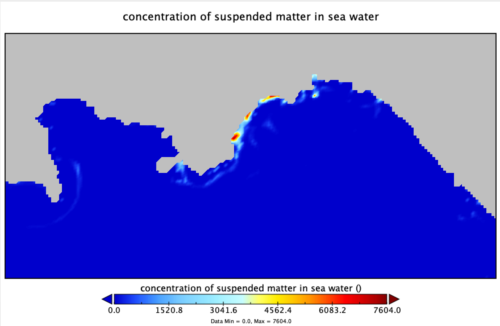

# WaComM++
WaComM++ is a steroidized version of WaComM - Water quality Community Model.
WaComM++ supports shared memory (OpenMP) and distributed memory (MPI) paralellization.

Water Community Model (WaComM) uses a particle-based Lagrangian approach relying on tridimensional marine dynamics field produced by coupled Eulerian atmosphere and ocean models.
WaComM has been developed matching the hierarchical parallelization design requirements.

WaComM is an evolution of the Lagrangian Assessment for Marine Pollution 3D (LAMP3D, https://people.mio.osupytheas.fr/~doglioli/lamp.htm) model.
We strongly optimized the algorithms improve the performance in high performance computing environments adding features as restarting, distributed, and shared memory parallelization.



WaComM is operatively used for pollutants trasnsport and diffution at the Center for Monitoring and Modelling Marine and Atmosphere applications (CMMMA, https://meteo.uniparthenope.it) run by the Department of Science and Technologies (DiST, https://dist.uniparthenope.it) of the University of Naples "Parthenope" (https://www.uniparthenope.it).

# Cite WaComM++
* Montella Raffaele, Diana Di Luccio, Pasquale Troiano, Angelo Riccio, Alison Brizius, and Ian Foster. "WaComM: A parallel Water quality Community Model for pollutant transport and dispersion operational predictions." In Signal-Image Technology & Internet-Based Systems (SITIS), 2016 12th International Conference on, pp. 717-724. IEEE, 2016.
https://ieeexplore.ieee.org/abstract/document/7907547/
  

* Di Luccio Diana, Angelo Riccio, Ardelio Galletti, Giuliano Laccetti, Marco Lapegna, Livia Marcellino, Sokol Kosta, and Raffaele Montella. "Coastal marine data crowdsourcing using the Internet of Floating Things: Improving the results of a water quality model." Ieee Access (2020).
  https://ieeexplore.ieee.org/abstract/document/9098885

# Compiling

WaComM++ is developed using C++17. Be sure a compatible toolchain is installed and available.
* Linux CentOS:
  yum install devtoolset-9
  
* MacOS:
  CLang
    
* Windows: Visual Sutudio

## Using the command line interface

1) Clone the repository
```bash
git clone https://github.com/CCMMMA/wacommplusplus.git
```
2) Enter the project directory
```bash
cd wacomplusplus
```
3) Create the build directory
```bash
mkdir build
```
4) Enter the build directory
```bash
cd build
```
5) Invoke cmake using the following options:
- USE_MPI - Activate the distributed memory parallelization.
- USE_OMP - Activate the shared memory parallelization.
- USE_OPENACC - Activate the OpenACC acceleration (future feature).
- USE_OPENCL - Activate the OpenCL acceleration (future feature).
- USE_CUDA - Activate the CUDA acceleration (future feature).
- DEBUG - Add logging printouts (do not use for production or evaluation.)
```bash
cmake ..
```
6) Run make and wait
```bash
make
```
## Using CLion 

1) Clone a new project from CVS
2) Enter https://github.com/CCMMMA/wacommplusplus.git as project URL
3) Press the Clone Button
4) Select *wacomplusplus* | Debug as target
5) Click on menu *Build*, option *Build Project*
6) Wait


# Testing
Download the data.

## CLion

1) Select *data | Debug*
2) Click on menu *Build*, option *Build data*
3) Wait
