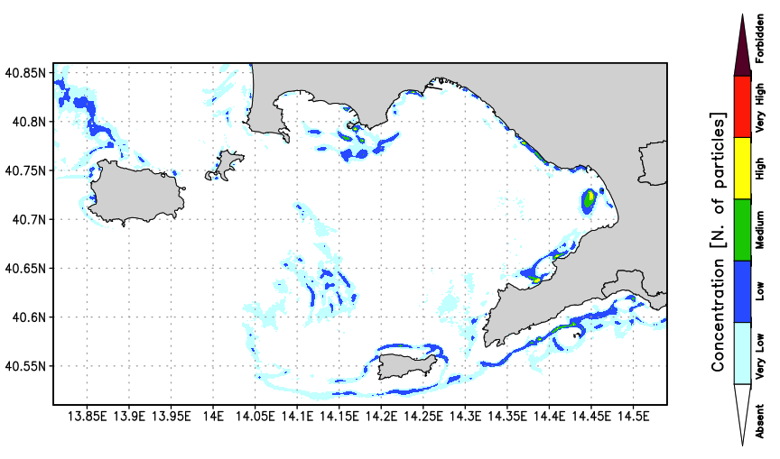

# WaComM++
WaComM++, the Water quality COMmunity Model in C++, is a highly scalable, high-performance Lagrangian transport and diffusion model for marine pollutants assessment.
WaComM++ supports CUDA GPU computation, shared memory (OpenMP), distributed memory (MPI) parallelization, and computational malleability with FlexMPI.

The Water Community Model (WaComM) uses a particle-based Lagrangian approach that relies on a tridimensional marine dynamics field produced by Eulerian atmosphere and ocean models.
WaComM has been developed to match the hierarchical parallelization design requirements.

WaComM is an evolution of the Lagrangian Assessment for Marine Pollution 3D (LAMP3D, https://people.mio.osupytheas.fr/~doglioli/lamp.htm) model.
We strongly optimized the algorithms to improve performance in high-performance computing environments by adding features such as restarting, GPU acceleration, and distributed and shared memory parallelization.



WaComM is operatively used for pollutants transport and diffusion at the Center for Monitoring and Modelling Marine and Atmosphere applications (CMMMA, https://meteo.uniparthenope.it) run by the Department of Science and Technologies (DiST, https://dist.uniparthenope.it) of the University of Naples "Parthenope" (https://www.uniparthenope.it).

It is used to compute the transport and diffusion of pollutants for assessing the water quality for mussel farming and 
fish breeding.

In WaComM, several basic algorithms have been optimized and to improve its performance on a High-Performance
Computing environment, some features like restarting and parallelization techniques in shared memory environments have
been added.

Pollutants are modeled as inert Lagrangian particles.

No interactions with other particles or feedback are included in the model.
The pollution sources are defined as a geographic location in terms of longitude, latitude, depth, the total amount
of Lagrangian particles released in one hour, and the emission profile that could be set statically or changed during the
simulation.

The WaComM system can be used in more ways: as a decision support tool, to aid in the selection of the most suitable
areas for farming activity deployment or in an ex-post fashion to achieve better management of offshore
activities.

# Parallelization schema
WaComM++ uses a particle-based Lagrangian approach relying on a tridimensional ocean dynamics field produced by coupled Eulerian ocean model.

WaComM++ has been designed with hierarchical parallelism in mind. Nevertheless, some requirements have been strongly driven by the transport and diffusion Lagrangian model, for example, the need for data exchange using standard and well-known formats.

The WaComM++ overall structure design is shown in the following figure.


The ocean state, adapted by the OceanModelAdapter component to be used for the transport and diffusion computation, is described by the variables _u_, _v_, _w_
(the horizontal and the vertical components of the sea current velocity vector), _zeta_ (the sea surface height),
and _AKT_ (vertical diffusivity for the temperature) at a given time _T_ in _K_, _J_, _I_ position.
The overall computation is performed over three nested cycles:
* *Ocean state outer cycle:* for each time-referenced dataset (usually 1-hour), a WaComM component is instanced. 
* *Particles outer cycle:* moves the particle to process using ocean data. 
* *Particle inner cycle:* moves the particle within the considered time slice, applying the Lagrangian transport and diffusion equations integrated on a given time step.

While time-dependent iterations characterize the ocean state outer cycle and the inner particle cycle, the particles' outer cycle has been hierarchically parallelized because each particle movement is independent.

Therefore, the OceanModelAdapter component prepares and adapts data from ocean simulations or forecasts to the data structures managed by the transport and diffusion model.
This data is managed as multidimensional matrices usually stored in NetCDF files. Although most parts of environmental models use the [NetCDF CF Conventions and Metadata](https://cfconventions.org),
some processing is needed to prepare the ocean state for WaComM++.

The Source component implements the sea pollutant emission generator. Each emission source is defined by its position (latitude, longitude, and depth),
the number of Lagrangian particles spilled out per hour and the emission time interval. 

We designed WaComM++ using an Object-Oriented approach applied to the physics equation solver embedded in the Particle component. First, each particle is moved using the algorithm implemented in the Particle component.

This component represents a Lagrangian particle characterized by its _3D position_, _timestamp of generation_, _age_, and _health_.

The _Particles_ component is composed of the _particle_ components.
Its duty deals with particle-related I/O operations as the state persistence among two simulations (restarting). 

The WaComMPlusPlus component aggregates OceanModelAdapter, Sources, and Particles.
This component manages the ocean state outer cycle, providing, for each time-related dataset, the WaComM component with the momentum (u, v, and w components of the current sea vector),
the variation of the sea surface height (zeta), and the vertical turbulent diffusion (AKT). The actual particle movement is encapsulated in the Particle component.

The WaComM component encapsulates the particles' outer cycle of the transport and diffusion model as detailed in [Montella et Al.](https://ieeexplore.ieee.org/abstract/document/10137219). 

# Acknowledgments
The following initiatives support waComM++ development:
* Research agreement MytilAI (CUP I65F21000040002, http://meteo.uniparthenope.it/mytiluse/) - Supporting operational pollutant transport and diffusion for AI-based farmed mussels contamination prediction.
* EuroHPC H2020 project ADMIRE (956748-ADMIRE-H2020-JTI-EuroHPC-2019-1, https://www.admire-eurohpc.eu) - WP7: Environmental application. Using malleability to improve the balance between the overall performance and the computational resource allocation. 

# Cite WaComM++
* Montella Raffaele, Diana Di Luccio, Ciro Giuseppe De Vita, Gennaro Mellone, Marco Lapegna, Gloria Ortega, Livia Marcellino, Enrico Zambianchi, and Giulio Giunta. "A highly scalable high-performance Lagrangian transport and diffusion model for marine pollutants assessment." In 2023 31st Euromicro International Conference on Parallel, Distributed and Network-Based Processing (PDP), pp. 17-26. IEEE, 2023.[Paper](https://ieeexplore.ieee.org/abstract/document/10137219) [BibText](https://scholar.googleusercontent.com/scholar.bib?q=info:lm5MT5UXsbsJ:scholar.google.com/&output=citation&scisdr=ClHkMdBFEO_Nu9tFARo:AFWwaeYAAAAAZXhDGRqgCwHQSP46ByXPJ7rmjkA&scisig=AFWwaeYAAAAAZXhDGcaIZF6NQTQBw0yZiqBLSsc&scisf=4&ct=citation&cd=-1&hl=en)
  
* Di Luccio Diana, Angelo Riccio, Ardelio Galletti, Giuliano Laccetti, Marco Lapegna, Livia Marcellino, Sokol Kosta, and Raffaele Montella. "Coastal marine data crowdsourcing using the Internet of Floating Things: Improving the results of a water quality model." Ieee Access (2020). [Paper](https://ieeexplore.ieee.org/abstract/document/9098885) [BibText](https://scholar.googleusercontent.com/scholar.bib?q=info:zfxBb1pXu6AJ:scholar.google.com/&output=citation&scisdr=CgVAs4t4EOqOsfORuKc:AAGBfm0AAAAAYmKXoKfXYbP_udXdxi_gRtDgpRDUlAmz&scisig=AAGBfm0AAAAAYmKXoDu_U64Tee-yjLp6iEBcYJ-8OeL3&scisf=4&ct=citation&cd=-1&hl=en)
  
* Montella Raffaele, Diana Di Luccio, Pasquale Troiano, Angelo Riccio, Alison Brizius, and Ian Foster. "WaComM: A parallel Water quality Community Model for pollutant transport and dispersion operational predictions." In Signal-Image Technology & Internet-Based Systems (SITIS), 2016 12th International Conference on, pp. 717-724. IEEE, 2016. [Paper](https://ieeexplore.ieee.org/abstract/document/7907547/) [BibText](https://scholar.googleusercontent.com/scholar.bib?q=info:GQ2xgOQgTAIJ:scholar.google.com/&output=citation&scisdr=CgVAs4t4EOqOsfOeWMg:AAGBfm0AAAAAYmKYQMjD60Uri5Fxi4GPm3sA0XYgFUze&scisig=AAGBfm0AAAAAYmKYQNXh2mxdhne78C84APWfiPyHNB9e&scisf=4&ct=citation&cd=-1&hl=en)

# Compiling

WaComM++ is developed using C++17. Be sure a compatible toolchain is installed and available.
* Linux CentOS:
  - install as root with
    ```bash
    yum install devtoolset-9
    ```
  - Set the environment as user
    ```bash
    scl enable devtoolset-9 -- bash
    ``
  
* MacOS:
  CLang
    
* Windows: Visual Sutudio

* Compiling on purpleJeans (http://rcf.uniparthenope.it) HPC-GPU-DNN Cluster.
Set the environment:
```bash
module load gcc-8.3.1 
module load ompi-4.1.0-gcc-8.3.1 
module load cmake/3.19.2 
module load cuda/10.1 
```

## Dependencies
Most dependencies involved in the WaComM++ building are automatically resolved by cmake at the source
preparation time (when cmake is invoked). Nevertheless, some dependencies have to be satisfied a priori:

1) [CMake](https://cmake.org): the latest is the better, the minimum required is the 3.13, but we are currently using the 3.19.
If your environment doesn't support an updated cmake version, you can install it in your user space.
   

2) [MPI](https://www.mpich.org): usually the most part of cluster environments offer one or more versions of already compiled MPI libraries.
Those MPI libraries are already integrated with the local scheduler and configured/optimized for the networking hardware 
available in the cluster. [OpenMPI](https://www.open-mpi.org) and [MVAPICH2](https://mvapich.cse.ohio-state.edu) have been tested. In conjunction with InfiniBand networks, we experienced 
some troubles in mixing MPI and OpenMP while using OpenMPI, but we successfully switched to MVAPICH2.


3) [CUDA](https://developer.nvidia.com/cuda-toolkit): we tested WaComM++ with CUDA 10.1 on GeeForce TitanX, Quadro and Tesla V100 equipments with success.
At the current development state, just the computing capabilities level 3.0 are required, so it could be possible to
use devices that are not recent CUDA-enabled. The production usage of non-Tesla devices could result
in irreversible hardware damage. By default, the CUDA Toolkit libraries are statically linked. If your environment uses
GPU remoting as [GVirtuS](https://github.com/gvirtus/) or [rCUDA](http://www.rcuda.net), please link the libraries
dynamically.
**NB:** Since version 11.0, the CUDA Toolkit is not longer available for MacOS. The latest supported
MacOS version is the 10.13.


4) [FlexMPI](https://gitlab.arcos.inf.uc3m.es/desingh/FlexMPI): ...
   
## Using the command line interface

1) Clone the repository
```bash
git clone https://github.com/CCMMMA/wacommplusplus.git
```
2) Enter the project directory
```bash
cd wacomplusplus
```
3) Create the build directory
```bash
mkdir build
```
4) Enter the build directory
```bash
cd build
```
5) Invoke cmake using the following options:
- USE_MPI - Activate the distributed memory parallelization.
- USE_OMP - Activate the shared memory parallelization.
- USE_FLEXMPI - Activate the computational malleability.
- USE_CUDA - Activate the CUDA acceleration.
- DEBUG - Add logging printouts (do not use for production or evaluation.)

WaComM++ uses cmake version 3. In some Linux systems, cmake is version 3 by default. In other systems, version 3
must be specified using the cmake3 command. 

- Example: compile vanilla WaComM++ (No parallelization)
```bash
cmake ..
```

- Example: compile with CUDA, OpenMP, and MPI support, but without extra debug logging:
```bash
cmake -DUSE_OMP=ON -DUSE_MPI=ON -DUSE_CUDA=ON -DDEBUG=OFF ..
```

6) Run, make, and wait

```bash
make
```

## Using CLion 

1) Clone a new project from CVS
2) Enter https://github.com/CCMMMA/wacommplusplus.git as the project URL
3) Press the Clone Button
4) Select *wacomplusplus* | Debug as target
5) Click on menu *Build*, option *Build Project*
6) Wait


# Testing
Download the data.

1) Open a console application (I.e. Terminal)
2) Change the current working directory to the WaComM++ building directory
3) Create the input, processed, output, and restart directories
```bash
mkdir input processed output restarts
```
4) Download the restart file
```bash
wget http://data.meteo.uniparthenope.it/opendap/opendap/wcm3/restart/WACOMM_rst_20201130Z00.txt
```
5) Link the source file
```bash
ln -sf ../examples/sources-campania_region.json sources.json
```
6) Link the configuration file
```bash
ln -sf ../examples/wacomm-roms-usecase-download.json wacomm.json
```
7) Launch WaComM++
```bash
./wacommplusplus
```
WaComM++ will perform a dry run (the model will not calculate the particles' transport and diffusion).
The demo data files will be downloaded from [meteo@uniparthenope](http://data.meteo.uniparthenope.it:/opendap/opendap/wcm3/d04/),
preprocessed, and saved in processed directory.

8) Link the configuration file
```bash
ln -sf ../examples/wacomm-native-usecase.json wacomm.json
```
Now, WaComM++ is ready to run.

# Running
Can you have a configuration file?
WaComM++ can read Fortran namelists used by classic WaComM implementation (https://github.com/ccmmma/wacomm).
If possible, use a native json configuration file.

## Vanilla (no MPI, no OMP, no acceleration)
WaComM++ can be used on machines with really poor computing resources, nevertheless producing an High-Performace
Computing cluster is warmly accompanied.

```bash
./wacommplusplus
```

Automatically search for namelist.wacomm or wacomm.json configuration file.

```bash
./wacommplusplus namelist|json
```

Use a namelist or a json configuration file.

## Shared memory parallelism (OpenMP)
WaComM++ supports shared memory parallelization using OpenMP threads.
Select the number of threads to use, exporting the OMP_NUM_THREADS environment variable.
Due to the embarrassing parallel algorithm, there is no limitation in the number of used threads.

```bash
export OMP_NUM_THREADS=n
./wacommplusplus
```
If the OMP_NUM_THREADS is not specified, OpenMPI assumes the number of threads is equal to the number of available CPU
cores.

## Distributed memory parallelism (Open MPI)
WaComM++ supports distributed memory parallelization using the Open MPI library.
Select the number of processes to use, specifying the -n or -np mpirun parameter.
Due to the embarrassing parallel algorithm, there is no limitation in the number of used processes.

```bash
mpirun -n np ./wacommplusplus
```

If WaComM++ has been compiled with both USE_MPI and USE_OMP options, it is possible to balance the number of threads
for each project.

Let be n the number of threads per process and np the number of processes, WaCom++ can be run as
follows:

```bash
export OMP_NUM_THREADS=n
mpirun -n np ./wacommplusplus
```
## Computational malleability (FlexMPI)

FLEX-MPI is a runtime system that extends the functionalities of the MPI library by providing dynamic load balancing and performance-aware malleability capabilities to MPI applications. Dynamic load balancing allows FLEX-MPI to adapt the workload assignments at runtime to the performance of the computing elements that execute the parallel application. Performance-aware malleability improves the performance of applications by changing the number of processes at runtime.

### Installation

Follow the instructions (https://gitlab.arcos.inf.uc3m.es/acascajo/adm_fmpi) to install Flex-MPI and IC (the intelligent controller communication library). Once Flex-MPI and IC are installed, edit the CMakeLists.txt file (lines 44-47) with the correct paths to where the different components were installed, e.g:

```
find_library(EMPI_LIBRARY empi HINTS "path_EMPI_lib")
find_library(PAPI_LIBRARY papi HINTS "path_PAPI_lib")
find_library(GLPK_LIBRARY glpk HINTS "path_GLPK_lib")
find_library(ICC_LIBRARY icc HINTS "path_ICC_lib")
```

- Example: compile with OpenMP, and Flex-MPI support:
```bash
cmake -DUSE_OMP=ON -DUSE_MPI=OFF -DUSE_EMPI=ON -DUSE_CUDA=OFF -DDEBUG=OFF ..
make
mpirun -n np ./wacommplusplus
```

NB: you hare to require access to https://gitlab.arcos.inf.uc3m.es/acascajo/adm_fmpi repository.

NB: the overall performance is strictly influenced by the architecture used.

# Data sources
The Center for Monitoring and Modelling Marine and Atmosphere applications (CMMMA, http://meteo.uniparthenope.it) produces data in a routinary fashion.

Data is available via OPeNDAP server (http://data.meteo.uniparthenope.it/opendap/opendap/) and via HTTP server (http://api.meteo.uniparthenope.it/files/).
Simulations produced by the Regional Ocean Model System (ROMS) set up in the Campania Region (Italy) are available here: http://api.meteo.uniparthenope.it/files/rms3/d03/history/

Data are stored as NetCDF files with a semantic consistent naming convention. Those data can be used to drive the WaComM++ model.
