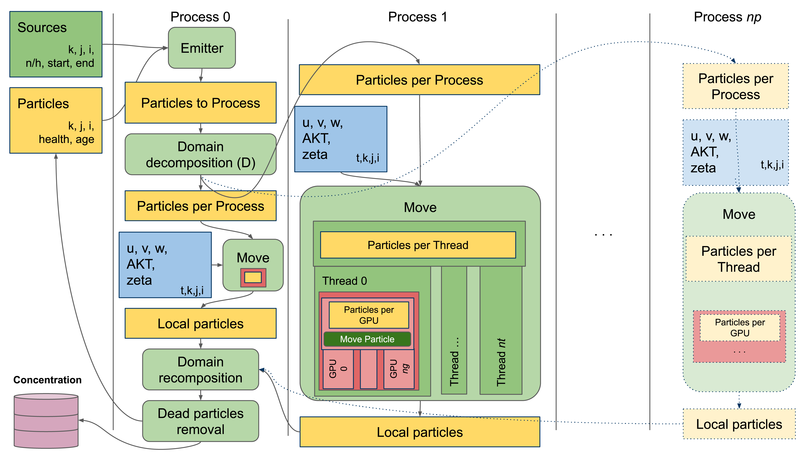

# WaComM++
WaComM++ is a steroidized version of WaComM - Water quality Community Model.
WaComM++ supports CUDA GPU computation, shared memory (OpenMP), and distributed memory (MPI) parallelization.

The Water Community Model (WaComM) uses a particle-based Lagrangian approach that relies on a tridimensional marine dynamics field produced by Eulerian atmosphere and ocean models.
WaComM has been developed to match the hierarchical parallelization design requirements.

WaComM is an evolution of the Lagrangian Assessment for Marine Pollution 3D (LAMP3D, https://people.mio.osupytheas.fr/~doglioli/lamp.htm) model.
We strongly optimized the algorithms to improve performance in high-performance computing environments by adding features such as restarting, distributed, and shared memory parallelization.


WaComM is operatively used for pollutants transport and diffusion at the Center for Monitoring and Modelling Marine and Atmosphere applications (CMMMA, https://meteo.uniparthenope.it) run by the Department of Science and Technologies (DiST, https://dist.uniparthenope.it) of the University of Naples "Parthenope" (https://www.uniparthenope.it).

It is used to compute the transport and diffusion of pollutants for assessing the water quality for mussel farming and 
fish breeding.

In WaComM, several basic algorithms have been optimized, and in order to improve its performance on a High-Performance
Computing environment, some features like restarting and parallelization techniques in shared memory environments have
been added.

Pollutants are modeled as inert Lagrangian particles.

No interactions with other particles or feedback are included in the model.
The pollution sources are defined as a geographic location in terms of longitude, latitude, depth, the total amount
of Lagrangian particles released in one hour, and the emission profile that could be set statically or changed during the
simulation.

The WaComM system can be used in more ways: as a decision support tool, to aid in the selection of the best suitable
areas for farming activity deployment, or in an ex-post fashion in order to achieve better management of offshore
activities.

# Parallelization schema
...


# Acknowledgments
WaComM++ development is supported by following initiatives:
* Research agreement MytilAI (CUP I65F21000040002, http://meteo.uniparthenope.it/mytiluse/) - Supporting operational pollutant transport and diffusion for AI-based farmed mussels contamination prediction.
* EuroHPC H2020 project ADMIRE (956748-ADMIRE-H2020-JTI-EuroHPC-2019-1, https://www.admire-eurohpc.eu) - WP7: Environmental application. Using malleability to improve balance between the overall performance and the computational resource allocation. 

# Cite WaComM++
* Montella Raffaele, Diana Di Luccio, Pasquale Troiano, Angelo Riccio, Alison Brizius, and Ian Foster. "WaComM: A parallel Water quality Community Model for pollutant transport and dispersion operational predictions." In Signal-Image Technology & Internet-Based Systems (SITIS), 2016 12th International Conference on, pp. 717-724. IEEE, 2016.
https://ieeexplore.ieee.org/abstract/document/7907547/
  

* Di Luccio Diana, Angelo Riccio, Ardelio Galletti, Giuliano Laccetti, Marco Lapegna, Livia Marcellino, Sokol Kosta, and Raffaele Montella. "Coastal marine data crowdsourcing using the Internet of Floating Things: Improving the results of a water quality model." Ieee Access (2020).
  https://ieeexplore.ieee.org/abstract/document/9098885

# Compiling

WaComM++ is developed using C++17. Be sure a compatible toolchain is installed and available.
* Linux CentOS:
  - install as root with
    ```bash
    yum install devtoolset-9
    ```
  - Set the environment as user
    ```bash
    `scl enable devtoolset-9 -- bash`
    ``
    
  
* MacOS:
  CLang
    
* Windows: Visual Sutudio

* Compiling on purpleJeans (http://rcf.uniparthenope.it) HPC-GPU-DNN Cluster.
Set the environment:
```bash
module load gcc-8.3.1 
module load ompi-4.1.0-gcc-8.3.1 
module load cmake/3.19.2 
module load cuda/10.1 
```

## Dependencies
The most part of the dependencies involved in the WaComM++ building are automatically resolved by cmake at the source
preparation time (when cmake is invoked). Nevertheless some dependencies have to be satisfied a priori:

1) [CMake](https://cmake.org): the latest is the better, the minimum required is the 3.13, but we are currently using the 3.19.
If your environment doesn't support an updated cmake version, you can install it in your user space.
   

2) [MPI](https://www.mpich.org): usually the most part of cluster environments offer one or more versions of already compiled MPI libraries.
Those MPI libraries are already integrated with the local scheduler and configured/optimized for the networking hardware 
available in the cluster. [OpenMPI](https://www.open-mpi.org) and [MVAPICH2](https://mvapich.cse.ohio-state.edu) have been tested. In conjunction with infiniband networks we experienced 
some troubles in mixing MPI and OpenMP while using OpenMPI, then we succesuffy switched to MVAPICH2.


3) [CUDA](https://developer.nvidia.com/cuda-toolkit): we tested WaComM++ with CUDA 10.1 on GeeForce TitanX, Quadro and Tesla V100 equipments with success.
At the current development state, just the computing capabilities level 3.0 are required, so it could be possible the
usage of not really recent CUDA enabled devices. Be aware that the production usage of non-Tesla devices could result
in rreversible hardware damages. By default the CUDA Toolkit libraries are statically linked. If your environment uses
GPU remoting as [GVirtuS](https://github.com/gvirtus/) or [rCUDA](http://www.rcuda.net), please link the libraries
dynamically. **NB:** Since the version 11.0, the CUDA Toolkit is not anymore available for MacOS. The latest supported
MacOS version is the 10.13.
   
## Using the command line interface

1) Clone the repository
```bash
git clone https://github.com/CCMMMA/wacommplusplus.git
```
2) Enter the project directory
```bash
cd wacomplusplus
```
3) Create the build directory
```bash
mkdir build
```
4) Enter the build directory
```bash
cd build
```
5) Invoke cmake using the following options:
- USE_MPI - Activate the distributed memory parallelization.
- USE_OMP - Activate the shared memory parallelization.
- USE_OPENACC - Activate the OpenACC acceleration (future feature).
- USE_CUDA - Activate the CUDA acceleration (future feature).
- DEBUG - Add logging printouts (do not use for production or evaluation.)

WaComM++ uses cmake version 3. In some Linux system cmake is the version 3 by default. In other systems the version 3
must be specified using the cmake3 command. 

- Example: compile vanilla WaComM++ (No parallelization)
```bash
cmake ..
```

- Example: compile with CUDA, OpenMP and MPI support, but without extra debug logging:
```bash
cmake -DUSE_OMP=ON -DUSE_MPI=ON -DUSE_CUDA=ON -DDEBUG=OFF ..
```

6) Run make and wait

```bash
make
```

## Using CLion 

1) Clone a new project from CVS
2) Enter https://github.com/CCMMMA/wacommplusplus.git as project URL
3) Press the Clone Button
4) Select *wacomplusplus* | Debug as target
5) Click on menu *Build*, option *Build Project*
6) Wait


# Testing
Download the data.

1) Open a console application (I.e. Terminal)
2) Change the current working directory as the WaComM++ building directory
3) Create the input, processed, output and restarts directories
```bash
mkdir input processed output restarts
```
4) Download the restart file
```bash
wget http://data.meteo.uniparthenope.it/opendap/opendap/wcm3/restart/WACOMM_rst_20201130Z00.txt
```
5) Link the sources file
```bash
ln -sf ../examples/sources-campania_region.json sources.json
```
6) Link the configuration file
```bash
ln -sf ../examples/wacomm-roms-usecase-download.json wacomm.json
```
7) Launch WaComM++
```bash
./wacommplusplus
```
WaComM++ will perform a dry run (the model will not actually calculate the particles transport and diffusion).
The demo data files will be downloaded from [meteo@uniparthenope](http://data.meteo.uniparthenope.it:/opendap/opendap/wcm3/d04/),
preprocessed, and saved in processed directory.

8) Link the configuration file
```bash
ln -sf ../examples/wacomm-native-usecase.json wacomm.json
```
Now WaComM++ is ready to run.

# Running
Be sure to have a configuration file.
WaComM++ can read Fortran namelists used by classic WaComM implementation (https://github.com/ccmmma/wacomm).
If possible, use native json configuration file.

## Vanilla (no MPI, no OMP, no acceleration)
WaComM++ can be used on machine with really poor computing resources, nevertheless production an High-Performace
Computing cluster is warmly raccomanded.

```bash
./wacommplusplus
```

Automatically search for namelist.wacomm or wacomm.json configuration file.

```bash
./wacommplusplus namelist|json
```

Use a namelist or a json configuration file.

## Shared memory parallelism (OpenMP)
WaComM++ supports shared memory parallelization using OpenMP threads.
Select the number of threads to use exporting the OMP_NUM_THREADS environment variable.
Due to the embarassing parallel algorithm, there is no limitation in the number of used threads.

```bash
export OMP_NUM_THREADS=n
./wacommplusplus
```
If the OMP_NUM_THREADS is not specified, OpenMPI assumes the number of threads is equals to the number of available CPU
cores.

## Distributed memory parallelism (Open MPI)
WaComM++ supports distributed memory parallelization using the Open MPI library.
Select the number of process to use specifying the -n or -np mpirun parameter.
Due to the embarassing parallel algorithm, there is no limitation in the number of used processes.

```bash
mpirun -n np ./wacommplusplus
```

If WaComM++ have been compiled with bouth USE_MPI and USE_OMP options, it is possible to balance the number of threads
for each prohect.

Let be n the number of threads per process and np the number of processes, WaCom++ can be run as
follows:

```bash
export OMP_NUM_THREADS=n
mpirun -n np ./wacommplusplus
```

NB: the overall performance are strictly influenced by the architecture used.

