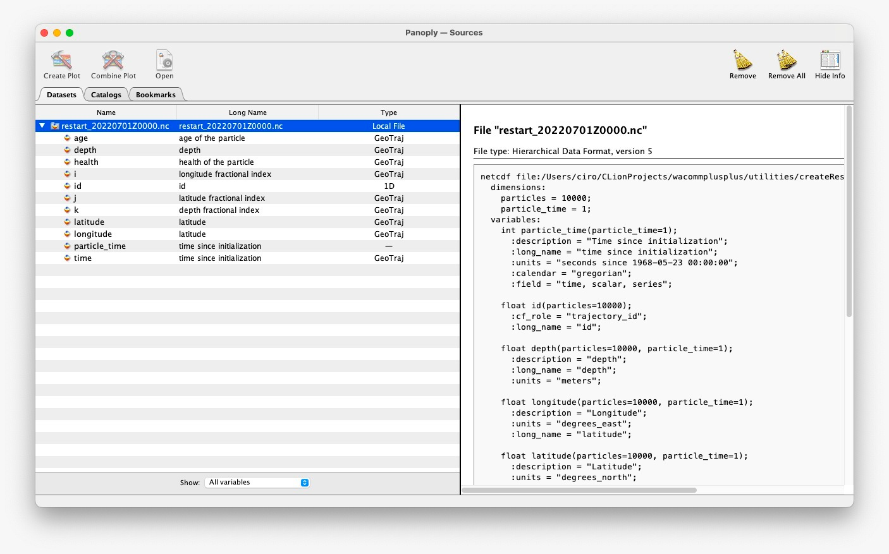

# WaComM++ utility for creating restart file starting from Json file

## Requirements (python3.6)


```bash
    python3.6 -m venv venv
    source venv/bin/activate
    pip3 install -r requirements.txt
```

## Usage

```bash
    python3 main.py <domain.nc> <features.json> <iDate>
```

### input

_domain.nc_: The domain definition of a WaComM++ simulation \
_features.json_: stores info about area where create random particles (you can use http://geojson.io coords to insert into json file ) \
_iDate_: YYYYMMDDZHH format

### output

NetCDF restart file containing particles



## Wacomm++

Inside configuration file (.json) set

```bash
...
    "restart": {
      "active": true,
      "restart_file": "restart_<iDate>.nc"
    },
    "sources": {
      "active": false,
      "sources_file": "sources.json"
    },
...
```

## Tutorial
The following tutorial is devoted to familiarize with oil spill or similar scenarios.
NB: the tutorial is far away to be completed

Download the domain definition
```bash
wget https://api.meteo.uniparthenope.it/files/wcm3/domains/d03.nc
```

Prepare the restart file
```bash
    python3 main.py d03 ../examples/oilspill-demo-01 20220915Z00
```

Run the simulation
```bash
    ./wacommplusplus ../oilspill-demo.json
```

